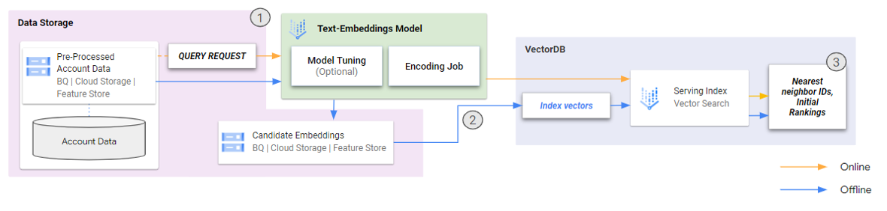

# vtt-similarity-matching

This project aims to demonstrate an effective approach for deduplicating customer account data by utilizing semantic similarity matching using text embeddings and Vertex AI Vertex Search. By employing synthetic data, the goal is to accurately identify and merge duplicate records, ensuring the database contains only unique customer account records. These techniques can be integrated into existing fuzzy matching workflows and systems.

## Getting started

Once the prerequisites have been met and the user parameters are specified, users can follow the notebook to run through the guided steps.

### Notebooks

The notebook is self-contained and can be run independently.

* [similarity-matching.ipynb](./similarity-matching.ipynb) : This notebook explores product description enhancement using the open-source GenAI model, Gemma, and evaluates its performance against Google's base models like Gemini as well as with human-alignment preferences.

### Prerequisites

Ensure the project environment, network settings, and service accounts used have the appropriate google cloud authentication and permissions to access the folloiwng services:
- `Vertex AI`
- `Cloud Storage`

## Workflow

This sample architecture demonstrates a workflow for building a semantic search system using vector embeddings. The process involves preparing embeddings from preprocessed account data, creating and deploying a vector database index, and performing inference and ranking to retrieve relevant results.

This system is flexible and can be deployed in both online and offline environments, allowing for customization depending on your specific requirements.

## Resources

* https://cloud.google.com/vertex-ai/docs/vector-search/overview
* https://cloud.google.com/vertex-ai/generative-ai/docs/embeddings
* https://cloud.google.com/vertex-ai/generative-ai/docs/models/tune-embeddings

Copyright 2024 Google, LLC. This software is provided as-is, without warranty or representation for any use or purpose. Your use of it is subject to your agreement with Google.
Licensed under the Apache License, Version 2.0 (the "License"); you may not use this file except in compliance with the License. You may obtain a copy of the License at

http://www.apache.org/licenses/LICENSE-2.0
